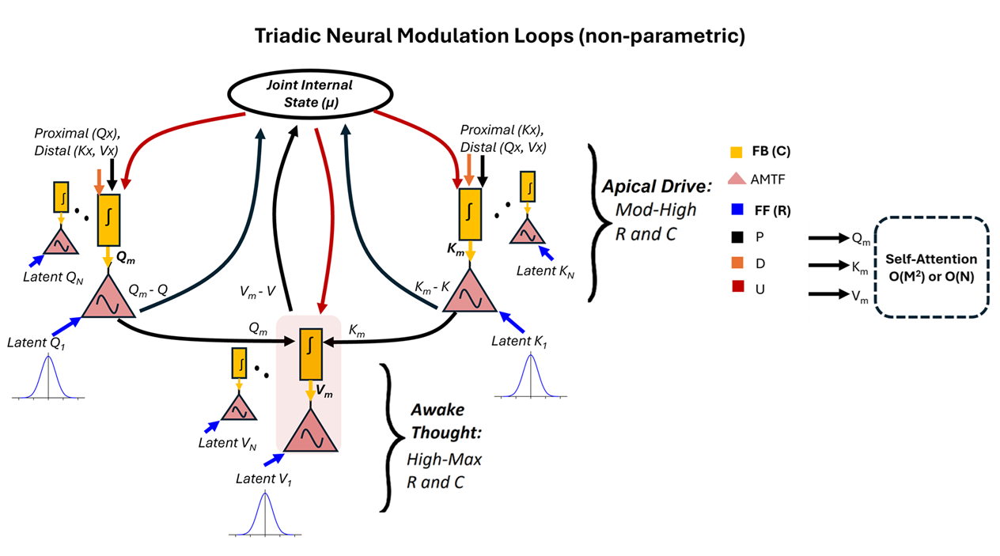

  

# Scalable Machines With Intrinsic Higher Mental States

  

## 🌐 Overview
This repository provides a general reference implementation of **Scalable Machines With Intrinsic Higher Mental States**, extending prior work _(adeel, 2025, beyond)_ with an open, scalable Cooperative Context-sensitive Cognitive Computation (Co^4) architecture and early validation on large-scale benchmarks such as ImageNet-1K. The model achieves near-linear scaling with respect to input size while enabling faster learning and reduced computational cost by using fewer heads, layers, and tokens.

This codebase is intentionally presented as a research platform rather than a finalized or optimized model. It is designed to support experimentation, understanding, and community-driven exploration of alternative architectural directions beyond standard attention mechanisms.

## 🏗️ Architecture

Latent Q_L, K_L, and V_L tokens are initialized from a random distribution and used as feedforward (FF) inputs or receptive fields (R). Input Q_X, K_X, V_X, and µ act as proximal (P), distal (D), and universal (U) contextual fields (CFs), providing feedback (FB) on the fly. The Q_m, K_m, and V_m TPN-like circuits evolve via asynchronous triadic Modulation Transfer Functions (AMTFs) under apical drive and apical drive + awake thought states. The evolved Q_m, K_m, and V_m are then selected and fed into the self-attention block.

## Gradient Flow  
The plot shows the interactive gradient flow of the cooperation dynamics defined by Cooperation(R, C) = R² + 2R + C(1 + |R|) and Cooperation(R, C) = C² + 2C + C(1 + |R|) revealing distinct bursting regimes that emerge from evidence–context coupling and their gradient flow.

## Object Classification 

Early training comparison between an attention-only Vision Transformer (ViT) (Dosovitskiy, 2020), trained from scratch, and a CO4 machine endowed with intrinsic higher mental states that pre-select relevant information before attention is applied, in a task to identify a bird from the Mini-ImageNet dataset. The brightness in the attention-only Transformer highlights areas after applying attention, whereas the CO4 model first highlights important regions in the image using its internal mechanisms, before attention is applied.

## Reinforcement Learning
### 🎥 Demo

<video src="https://github-production-user-asset-6210df.s3.amazonaws.com/122742805/545188999-4373bd43-49a4-495e-881a-697671bd48ca.mp4"
       controls
       muted
       loop
       playsinline
       width="100%">
</video>

Comparison of a permutation-invariant Transformer (left) and the CO4 model with intrinsic higher-order mental states (right), both trained for 100 episodes; CO4 reaches ~700 reward while transformer only reaches 245 reward.

## 📄 License
The source code is released under the [Creative Commons Attribution–NonCommercial 4.0 International (CC BY-NC 4.0)](https://creativecommons.org/licenses/by-nc/4.0/) license, permitting reuse and modification for research and academic purposes while restricting commercial use — see the [LICENSE](LICENSE) file for details.

## BibTeX
@article{adeel2025beyond,
  title={Beyond Attention: Toward Machines with Intrinsic Higher Mental States},
  author={Adeel, Ahsan},
  journal={arXiv preprint arXiv:2505.06257},
  year={2025}
}
