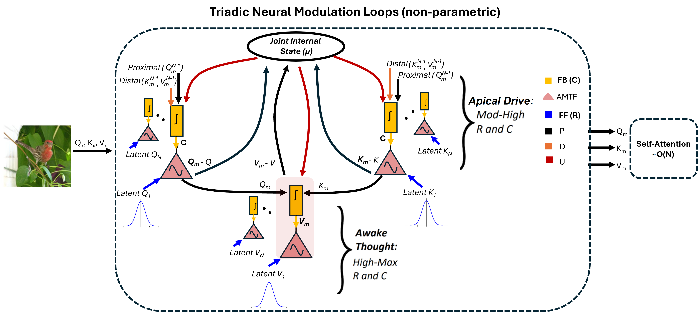
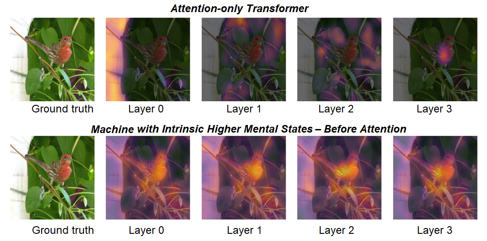
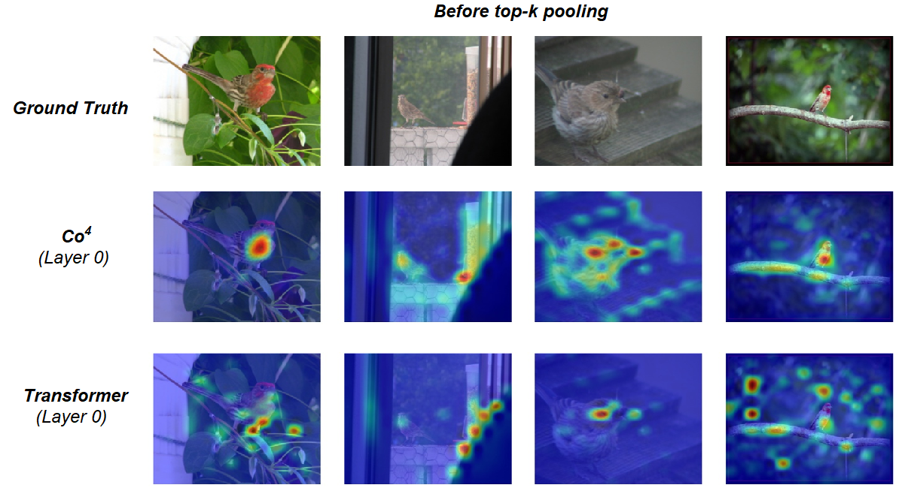

  

# Scalable Machines With Intrinsic Higher Mental States

  

## 🌐 Overview 
This repository provides a reference implementation of _Scalable Machine with Intrinsic Higher Mental States_, demonstrating how machines can emulate cellular neurobiological principles associated with awake thought (imagination) states to pre-select coherent information prior to attention computation, thereby enabling a rapid transition from initial biases to refined understanding.

The code is released as an open research platform rather than a finalized architecture to support reproducible research and community-driven development. It includes a fully reproducible framework comprising training scripts, evaluation pipelines, configuration files, and pretrained checkpoints corresponding to the experiments reported in the paper.

## 🧠 Core idea

Standard Transformer architectures primarily compute relevance through attention, often relying on deep stacks and quadratic attention complexity. In contrast, the Co⁴ architecture introduces intrinsic regime-dependent processing dynamics that enable the model to:

- generate internal predictions to pre-select relevant information prior to attention via neuronal-level triadic Q–K–V modulation loops.
- enforce contextual coherence at the representation level before attention is applied.
- accelerate learning while reducing computational demand (e.g., fewer heads, layers, and tokens)
- approximate near-linear scaling behaviour in 𝑁 

**Downstream Readout After Coherence Establishment**

Once Co⁴ establishes coherence, i.e., a separation between relevant/coherent and irrelevant/incoherent tokens, the exact downstream readout operator (e.g., pruning, gating, or a gated MLP in place of attention) becomes less critical and can be selected based on design priorities.

**Example Design Choices**

- **MLP-only routing (no attention)**: Fully replacing attention with simple MLP-only routing on modulated _V_ (e.g., Liu et al., 2021) yields strictly $\mathcal{O}(N)$ complexity.
- **Top-_k_ attention over coherent tokens**: Using top-_k_ relevant tokens for attention operates at an approximate computational cost of $\mathcal{O}(N + k^2)$, where _N_ denotes the number of input tokens and $k$ denotes the selected top-_k_ coherent tokens. Since $k \ll N$ and $k \le \sqrt{N}$, the model exhibits near-linear scaling in $N$.

**Empirical Behaviour**

Both readout approaches support comparably faster learning with substantially reduced computational demand in Co⁴ (See Figure 8). A top-_k_ relevant token strategy is applied and reported for both Co⁴ and ViT under matched experimental settings to enable a controlled comparison.

**Empirical observation:**

- Reducing the top-_k_ tokens improves performance in Co⁴.
- Applying the same top-_k_ feature selection to ViT results in performance degradation.

This behaviour contrasts with the commonly reported behaviour of standard Transformer-based models, which often benefit from increased context length, although such gains depend on training regime and architectural design.

## 📊 Reproducing key results

The repository includes scripts for reproducing experiments reported in the paper:

- CIFAR-10
- Tiny-ImageNet
- Mini-ImageNet
- ImageNet-1K (early scaling)
- CartPole
- PyBullet Ant
- Acrobot
- MountainCar
- CarRacing

These correspond to:

- Figure 4 (vision experiments)
- Figure 5 (RL experiments)
- Table 1–4 (ablation and scaling results)

## 🏗️ Architecture
The specific form of the triadic modulation loops and the _R–C_ integration strategies may vary across datasets and hyperparameter configurations. For example, the figure below represents one of the architectural variants evaluated in _(Adeel et al., 2026)_, building on the basic architecture _(Adeel et al., 2025)_; other architectural instantiations are possible. The key element, however, is the cooperative modulation dynamics operating under distinct mental-state-dependent processing regimes.

## Latent Triadic Modulation Mechanism

Latent tokens $Q_L$, $K_L$, and $V_L$ are initialized from a random distribution and used as feedforward (FF) inputs or receptive fields (R). Contextual input (context-modulated prediction), $Q^{n-1}_m$, $K^{n-1}_m$, $V^{n-1}_m$, and μ act as proximal (P), distal (D), and universal (U) context (C), providing feedback (FB). For the first layer, these are equal to: $Q_X$, $K_X$, $V_X$, and initialized μ. The TPN-like circuits $Q_m$, $K_m$, and $V_m$ evolve via asynchronous triadic Modulation Transfer Functions (AMTFs) under Apical Drive (AD) and Apical Drive + Awake Thought (AD + Awake) states. The evolved latent tokens $Q_m$, $K_m$, and $V_m$ are then selected and fed into the self-attention block.

## Gradient Flow  
Different modulatory cooperation laws Φ(𝑅,𝐶) reshape the cooperation surface and its gradient field ∇Φ(𝑅,𝐶) over the 𝑅−𝐶. Changes in contextual and receptive-field strength move the system between apical isolation, apical amplification, apical drive, and AD+Awake regimes, producing corresponding deformations in the geometry of gradient flow. By shaping representations prior to attention, these modulation laws guide gradients along coherent RF–CF interaction manifolds, reducing propagation through noisy or irrelevant directions. This structured learning geometry helps explain the faster convergence and improved learning efficiency observed in Co4 compared to standard Transformers, where gradients propagate without such context-conditioned modulation.

## Object Classification 

Early training comparison between an attention-only ViT _(Dosovitskiy et al., 2020)_, trained from scratch, and a Co4 machine endowed with intrinsic mental-state-dependent processing regimes that pre-select relevant information _before_ attention is applied. The task is to identify a bird from the Mini-ImageNet dataset. In the ViT model, brightness indicates regions emphasized after attention. In contrast, Co4 rapidly forms a coherent interpretation of the input, highlighting the top-_k_ salient regions via internally generated awake imaginative regimes \textit{before} attention is computed. Co4 exhibits earlier and sharper activation over the semantically relevant object (bird), indicating more coherent internal inference. Faster early-stage learning is observed for Co4. These findings raise questions about the necessity of deep attention stacks.

The figure visualizes the complete attention distribution over \textit{N} input tokens: Single-layer Co4 machine   vs. an attention-only Vision Transformer (ViT) _(Dosovitskiy et al., 2020)_, both trained on Mini-ImageNet for 30 epochs. The ViT exhibits more dispersed attention with less selective localization. In contrast, Co4 demonstrates more centered, context-sensitive activation patterns, indicating stronger spatial coherence.

## Reinforcement Learning
### 🎥 Demo

<!--<video src="https://github-production-user-asset-6210df.s3.amazonaws.com/122742805/546751693-1b619473-1e64-405b-ae85-c0d4dc1ea571.mp4"
       controls
       muted
       loop
       playsinline
       width="100%">
</video>
-->

https://github.com/user-attachments/assets/892a8595-3071-4b2a-a9c7-d8e151ec111d

Comparison of a permutation-invariant Transformer (left) and the CO4 model with intrinsic higher-order mental states (right), both trained for 100 episodes; CO4 reaches ~700 reward while transformer only reaches 245 reward.

## 📄 License
The source code is released under the [Creative Commons Attribution–NonCommercial 4.0 International (CC BY-NC 4.0)](https://creativecommons.org/licenses/by-nc/4.0/) license, permitting reuse and modification for research and academic purposes while restricting commercial use — see the [LICENSE](LICENSE) file for details.

## BibTeX
@article{adeel2025beyond,
  title   = {Beyond Attention: Toward Machines with Intrinsic Higher Mental States},
  author  = {Adeel, Ahsan},
  journal = {arXiv preprint arXiv:2505.06257},
  year    = {2025}
}

@article{adeel2026scalable,
  title   = {Scalable Machines With Intrinsic Higher Mental States},
  author  = {Adeel, Ahsan et al.,},
  journal = {arXiv preprint},
  note    = {arXiv submission (in preparation)},
  year    = {2026}
}

