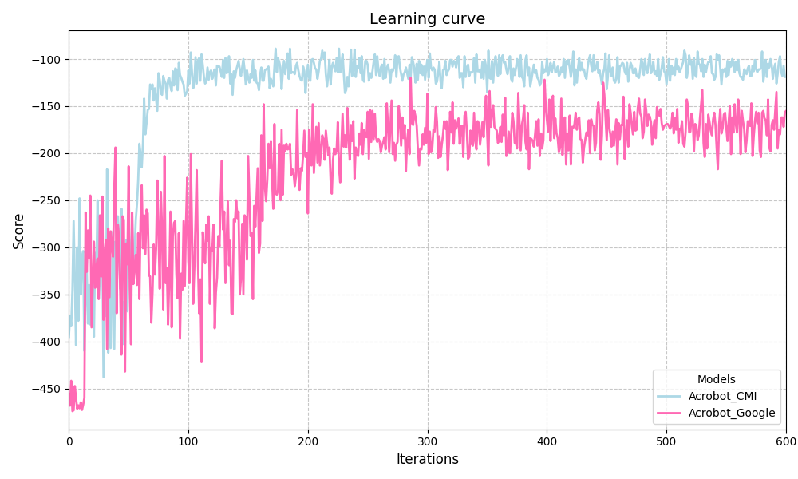
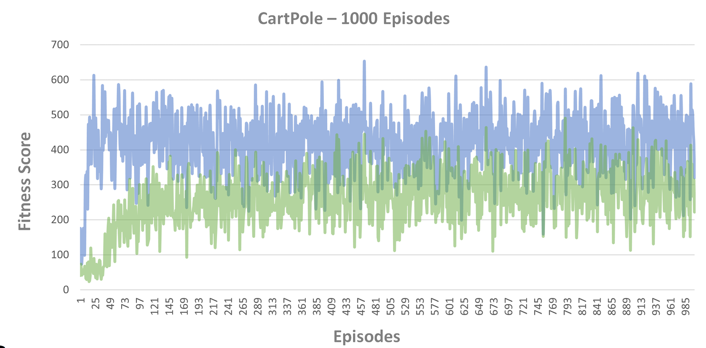
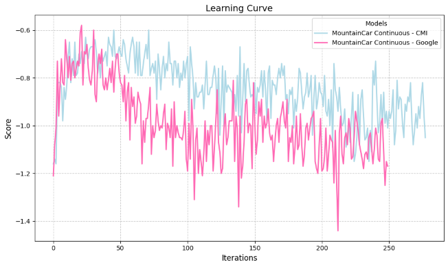
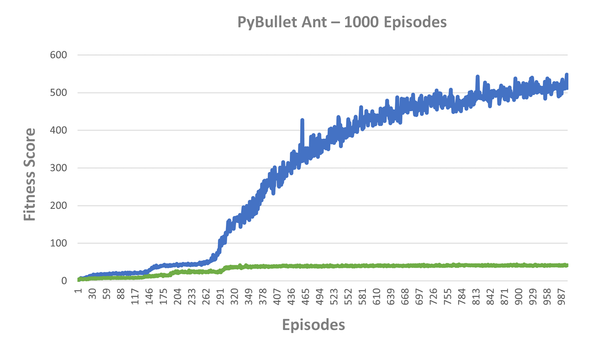

# Scalable Machines with Intrinsic Higher Mental States RL Simulations

Implementation of Scalable Machines with Intrinsic Higher Mental States in Google's PI: https://github.com/google/brain-tokyo-workshop

How to run:
- Install Python 
- Create Python Env: `python -m venv .venv`
- Activate Environment: `source .venv/bin/activate`
- Install Dependencies: `pip install -r requirements_comprehensive.txt`

Go into the AttentionNeuron folder before the following.

To train:
- `python train_agent.py --config configs/x.gin --log-dir log/x --num-workers 6`
- Environments run on CPU when on Rollout, so running the code on GPU doesnt have any impact
- Individual Classes has been assigned, making the code lengthy but modular

To evaluate: 
- `python eval_agent.py --log-dir log/x --model-filename best.npz`

# Training Plots Comparison

